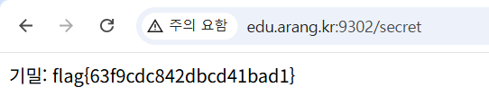

## 2fa-bypass

```python
@app.route("/secret")
def secret():
    # ── 결함: OTP 완료('done')가 아니라 비번단계('otp')만 확인 ──
    if session.get("stage") in ("otp", "done"):
        return "기밀: " + FLAG
    return redirect("/login")
```

OTP 인증을 완료한 stage 값은 done인데 비밀번호만 인증한 stage 값인 otp도 통과 시키기 때문에 `/secret` 페이지에 접근해 flag를 획득 할 수 있을 것이다.

```python
http://edu.arang.kr:9302/secret
```



flag{63f9cdc842dbcd41bad1}
