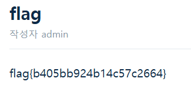

## csrf-1

```python
def content_transform(content):
    # 마크다운 이미지 !alt →   (먼저 " 제거)
    return re.sub(r"!\[(.*?)\]\((.*?)\)", r'', content.replace('"', ''))

@app.route("/changepw")
    def changepw():
        if "userid" not in request.args or "userpw" not in request.args:
            return '<form method="GET" action="/changepw"><input name="userid"><input name="userpw"><button>change</button></form>'
        userid = request.args["userid"]; userpw = request.args["userpw"]
        if userid == "admin":
            if request.remote_addr != socket.gethostbyname("bot"):
                return "admin password is only changed at internal network"
        if userid in users:
            users[userid] = userpw
            if userid == "admin":
                # 여러 학생이 동시에 풀어도 서로 덮어쓰지 않도록 '설정된 비번'을 누적한다
                admin_pws.add(userpw)
            return redirect("/login")
        return "user doesn't exist"
```

위의 코드를 보면 마크 다운 이미지 삽입 문법을 <img src 태그로 바꿔 준다는 것을 알 수 있고 changepw를 실행하기 위해서는 관리자 로컬이 필요하다는 사실까지 알 수 있었다.

```markdown

```

해당 페이로드가 있는 게시물을 bot으로 읽은 후 id:admin,pw:matherfather로 로그인한 결과 flag를 획득할 수 있었다.



flag{b405bb924b14c57c2664}
