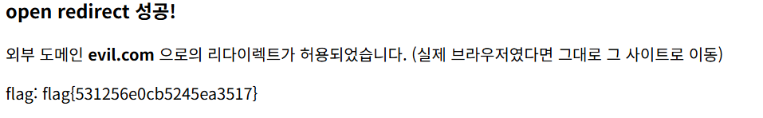

## Open Redirect

```python
def is_safe(url):
    # 의도적으로 허술한 검사: 'localhost' 포함 또는 '/' 시작이면 안전하다고 판단
    return url.startswith("/") or "localhost" in url
```

/로 시작하거나 localhost가 있으면 안전하다고 판단하는 부분에서 open redirect 취약점이 있음을 알 수 있었다.

```python
host = urlparse(nxt if "://" in nxt else "http://x" + nxt).hostname or ""

if host and host not in ("x", "") and "localhost" not in host and not nxt.startswith("/welcome"):
```

이 부분에서 url의 host 부분이 localhost가 아니면 위 필터링을 넘어와야 된다는 사실을 알게 되었다.

```python
/go?next=http://localhost@evil.com/
```

페이로드를 동작시켜보면 플래그 획득이 가능하다



flag{531256e0cb5245ea3517}
