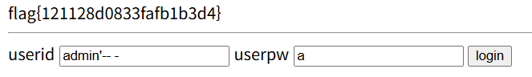

## SQLi-1

```php
$q = "SELECT userid FROM sqli1_table WHERE userid='$_GET[userid]' AND userpw='$_GET[userpw]'";
```

url 입력에 다른 제약 조건이 없으므로 `userid=admin ‘-- -` 를 넣어주면 pw 부분은 주석처리가 되기 때문에 flag를 획득할 수 있다.



flag{121128d0833fafb1b3d4}
