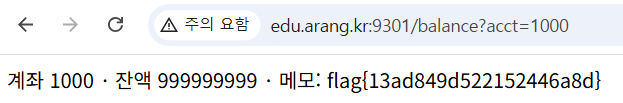

## idor-balance

```html
USERS = {"guest": "guest"}
ACCTS = {
    "1001": {"owner": "guest", "balance": 12000, "memo": "내 입출금통장"},
    "1000": {"owner": "admin", "balance": 999999999, "memo": FLAG},  # 관리자 계좌 메모에 flag
```

guest/guest로 로그인이 가능하기 때문에 로그인을 하였다.

```html
acct = request.args.get("acct", "")
    a = ACCTS.get(acct)
    if not a:
        return "없는 계좌"
    # ── IDOR: 세션 사용자와 계좌 소유자 일치 검증이 없음 ──
    return "계좌 %s · 잔액 %s · 메모: %s" % (acct, a["balance"], a["memo"])
```

세션 사용자와 계좌 소유자의 검증이 ㅇ벗기 때문에 acct 값만 1000으로 바꾸게 되면 플래그 획득이 가능하다 acct=1000을 하게 되면 아래와 같이 플래그 획득이 가능하다



flag{13ad849d522152446a8d}
