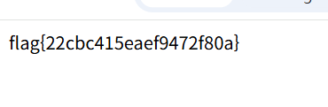

## jsp-sqli

```python
String uid = request.getParameter("userid");
String upw = request.getParameter("userpw");
...
String q = "SELECT userid FROM jsp_users WHERE userid='" + uid + "' AND userpw='" + upw + "'";
```

입력이 별도의 필터링 없이 삽입된다는 사실을 알게 되었다.

`userid:admin'-- - userpw:a` 를 입력하여 admin 계정으로 접속하였다.



flag를 획득 할 수 있었다

flag{22cbc415eaef9472f80a}
