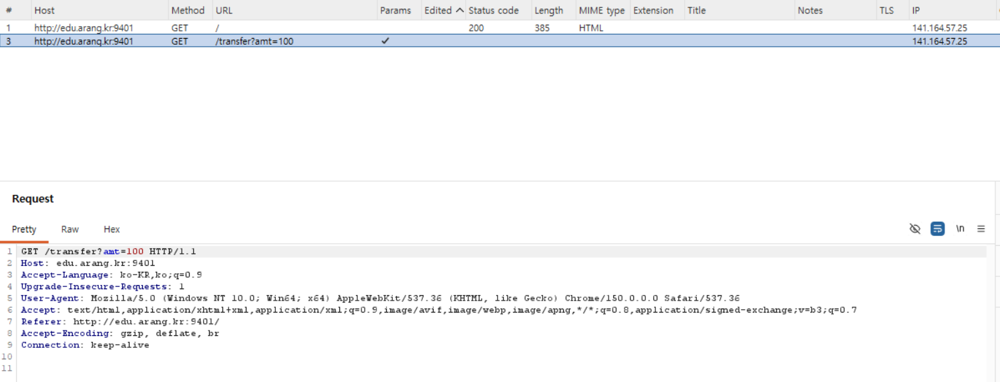
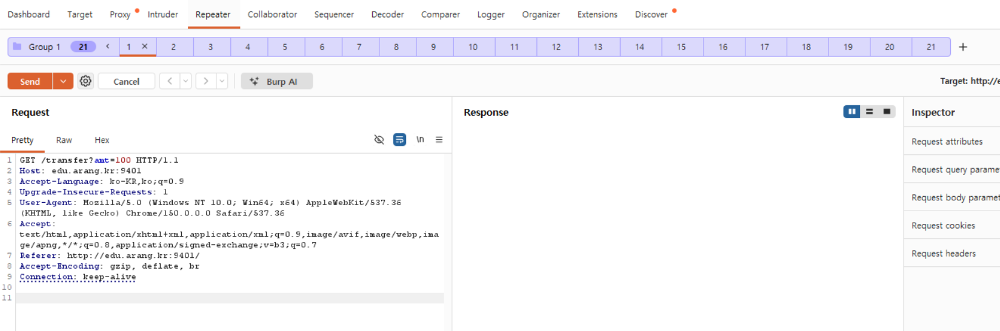
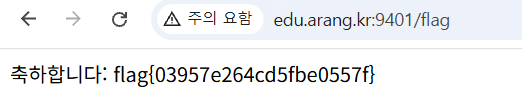

## logic/race-transfer

```python
@app.route("/transfer")
def transfer():
    amt = int(request.args.get("amt", "0"))
    if amt > 0 and bal["me"] >= amt:        # 검증
        time.sleep(0.15)                    # ── 경합 창(race window) ──
        bal["me"] -= amt                    # 차감 (비원자적)
        bal["vault"] = bal.get("vault", 0) + amt
        return "ok me=%d vault=%d" % (bal["me"], bal["vault"])
    return "잔액 부족 me=%d" % bal["me"]
    
@app.route("/flag")
def flag():
    if bal["vault"] >= WIN:
        return "축하합니다: " + FLAG
    return "vault=%d (%d 필요)" % (bal["vault"], WIN) #WIN = 1000
```

sleep(0.15)가 있기 때문에 해당 시간 동안 요청을 여러 개 보내 vault 값을 1000 보다 크게 만들면 flag를 획득 할 수 있을 것이다



요청을 여러 개 보내기 위해 burp suite를 이용해 패킷을 잡은 후 



repeater 기능을 이용해 요청을 날렸다.



flag를 획득할 수 있다.

flag{03957e264cd5fbe0557f}
